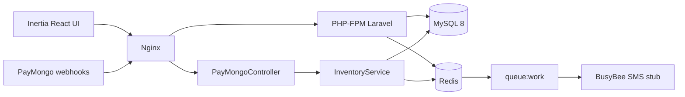

# StockLane

SME inventory with low-stock SMS alerts and PayMongo restock payment webhooks.

Portfolio project (2026). Built to close a PHP / Laravel / MySQL / queues / Sanctum / LAMP gap with a product-shaped codebase, not a generic CRUD demo.

## What it does

- Track products by SKU with on-hand quantity and a reorder threshold
- Record stock movements (sale, restock, adjustment)
- Queue an SMS job when quantity drops to or below `reorder_at`
- Accept PayMongo payment webhooks to restock inventory after a successful restock payment
- Optional Sanctum API tokens for machine-to-machine product reads

## Architecture



## Local run (Windows, no Docker)

Portable PHP used for verification: `C:\Users\jcuad\AppData\Local\Programs\php83\php.exe`

```bash
cd backend
# copy ../.env.example to .env and set DB_CONNECTION=sqlite + DB_DATABASE absolute path
php artisan key:generate
php artisan migrate --force
php artisan stocklane:seed-demo
npm install && npm run build
php artisan serve --host=127.0.0.1 --port=8000
```

Open http://127.0.0.1:8000 — inventory board (sale / restock).

```bash
php artisan test
```

Expected: 6 passed.

## Stack

| Layer | Choice |
|-------|--------|
| App | Laravel 12-shaped PHP (hand-written tree; Composer install required locally or in Docker) |
| UI | Inertia.js + React + Vite + Tailwind-style utility classes |
| DB | MySQL 8 |
| Queue | Redis + `queue:work` |
| Auth API | Laravel Sanctum (optional bearer tokens) |
| Edge | nginx reverse proxy |
| Tests | PHPUnit feature tests |

## Local run (Docker)

Prerequisites: Docker Desktop.

```bash
cp .env.example .env
docker compose up --build -d
docker compose exec app php artisan key:generate
docker compose exec app php artisan migrate --force
```

Open http://localhost:8080

Queue worker and nginx are started by Compose. Logs:

```bash
docker compose logs -f worker
docker compose exec app php artisan test
```

### Without Docker (honesty note)

This repo ships a full Laravel-shaped tree. PHP and Composer are not assumed on PATH. Prefer Docker. If you install PHP 8.3+, Composer, MySQL, and Redis yourself:

```bash
cd backend
composer install
cp ../.env.example .env
php artisan key:generate
php artisan migrate
npm install && npm run build
php artisan serve
php artisan queue:work redis
```

## Domain model (short)

- **Product** -- sku, name, quantity, reorder_at
- **StockMovement** -- delta, reason, reference (sale / restock / webhook)
- **PaymentEvent** -- PayMongo event id, status, payload hash (idempotent)
- **SendLowStockSmsJob** -- dispatched when qty <= reorder_at; talks to `SmsGateway` (BusyBee stub)

## PayMongo webhook flow

1. Merchant completes a restock checkout in PayMongo (or test payload)
2. `POST /webhooks/paymongo` receives the event
3. `PayMongoWebhookService` verifies signature header shape, dedupes by event id
4. On `payment.paid`, `InventoryService::restockFromPayment` increments qty and writes a movement
5. If still below threshold after other sales, low-stock SMS can fire again on the next dip

## Honesty / portfolio framing

- Built in 2026 as a portfolio artifact to demonstrate Laravel queues, webhooks, Inertia, and MySQL under nginx
- SMS provider is a stub interface (`BusyBeeSmsGateway`) -- swap for a real provider later
- PayMongo signature verification is structured for production but uses a documented test secret from `.env.example` only
- No real secrets are committed

## GitHub-ready

- ASCII punctuation only in docs and configs
- `.env.example` with safe defaults
- `.gitignore` excludes `.env`, vendor, node_modules, built assets
- Feature tests for inventory and webhooks
- Optional `render.yaml` for a Render blueprint sketch

## License

MIT -- portfolio use.
