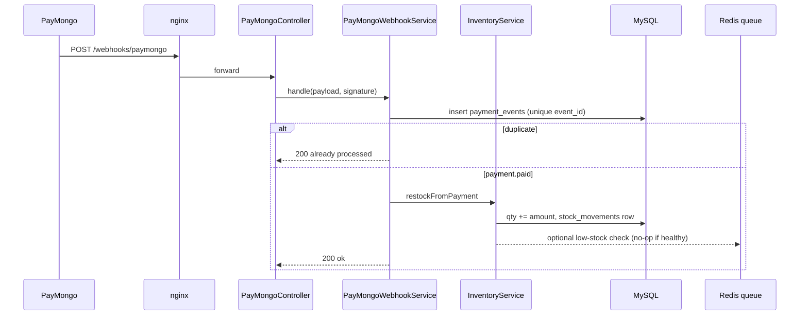
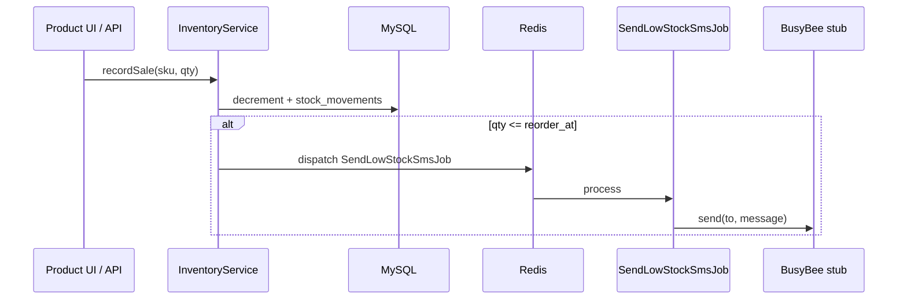

# StockLane Implementation Plan

> **For Claude:** REQUIRED SUB-SKILL: Use superpowers:executing-plans to implement this plan task-by-task.

**Goal:** Ship a product-shaped SME inventory app (SKU qty, low-stock SMS queue, PayMongo restock webhooks, Inertia board, Sanctum API) that closes the PHP/Laravel/MySQL/LAMP portfolio gap.

**Architecture:** Laravel behind nginx; Inertia React UI; MySQL persistence; Redis queue worker for SMS; idempotent PayMongo webhook restock path.

**Tech Stack:** Laravel 12-shaped PHP, Inertia + React + Vite, MySQL 8, Redis, Sanctum, PHPUnit, Docker (php-fpm + nginx).

Date: 2026-08-29
Status: scaffold complete; ready for `composer install` + Docker bring-up

## Goal (detail)

1. Tracks SKU quantity and reorder thresholds
2. Queues low-stock SMS alerts (BusyBee stub)
3. Restocks via PayMongo payment webhooks
4. Serves an Inertia React product board behind nginx
5. Exposes optional Sanctum API for product listing

## Non-goals

- Full multi-tenant billing UI
- Real BusyBee production credentials
- Mobile apps
- GraphQL

## Architecture decisions

| Decision | Choice | Why |
|----------|--------|-----|
| Framework shape | Laravel 11/12 tree, hand-written | Composer not on host PATH; Docker builds deps |
| Frontend | Inertia + React + Vite | Matches modern Laravel hiring expectations |
| Queue | Redis | Same pattern as production LAMP+queue shops |
| Webhooks | Idempotent PaymentEvent rows | Safe retries from PayMongo |
| SMS | Interface + stub | Honest portfolio; swap later |
| API | Sanctum optional | Shows token auth without forcing SPA session complexity |

## Work packages

### WP1 -- Platform

- [x] docker-compose: mysql, redis, app (php-fpm), worker, nginx
- [x] nginx default.conf proxy to php-fpm
- [x] .env.example, .gitignore, README, render.yaml

### WP2 -- Domain

- [x] Migrations: users, products, stock_movements, payment_events
- [x] Models with relations and casts
- [x] InventoryService (adjust, restock, low-stock dispatch)
- [x] SendLowStockSmsJob + SmsGateway contract

### WP3 -- HTTP

- [x] ProductController (Inertia Index)
- [x] PayMongoController webhook
- [x] ProductApiController (Sanctum)
- [x] routes web/api/console

### WP4 -- Frontend

- [x] resources/js/app.tsx
- [x] Pages/Products/Index.tsx with Tailwind utility classes
- [x] package.json / vite config

### WP5 -- Tests

- [x] InventoryTest -- movement + low-stock job dispatch
- [x] PayMongoWebhookTest -- paid event restocks; duplicate ignored

## Sequence: restock webhook



## Sequence: low-stock SMS



## Verification

```bash
docker compose up --build -d
docker compose exec app php artisan migrate --force
docker compose exec app php artisan test
curl -s http://localhost:8080/ | head
```

## Follow-ups (post-scaffold)

- [ ] Real PayMongo signature HMAC with live webhook secret
- [ ] BusyBee HTTP client implementation behind SmsGateway
- [ ] Filament or simple auth scaffolding for merchants
- [ ] Horizon dashboard if Redis traffic grows

## Risks

- Hand-written Laravel tree may miss a few framework files until `composer create-project` sync; Docker image installs framework packages from composer.json
- PHPUnit needs `composer install` inside the container before tests pass
